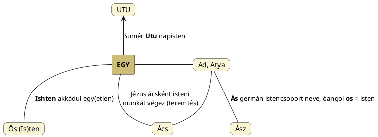

---
{"dg-publish":true,"permalink":"/A/Ádám/","title":"Ádám","tags":["Englishtexttranslated","containstransclusions"],"created":"2024-05-18T11:49","updated":"2024-10-22T21:31"}
---

# Ádám

#### Péterfai János írja:

> Ádám[^1] a magyar ősapa, a szumer Ad, Ada, Adda nevek azt bizonyítják, hogy Ádám neve kapcsolható a szumerokhoz. A magyar Ad ige és Ada városnév is valószínűsíti Ádám magyar eredetét. Adam nevében az Ad ige jelenik meg főnévi értelemben, az Am Hely[^2]. Mindig az Atya Ad, és az Anya Kap, áldást pedig a gyerekek, akik öröklik szüleik vagyonát. Valójában Ádám a Nap, Éva pedig az Év, az adminiták pedig az egyik nagyon régi, őskori magyar törzs. Egy szumer eposzból pontosan meg lehet érteni, hogy Ádám és [[E/Éva\|Éva]] valójában csillagászati fogalmak. Ádám, vagyis Udum jár az égen, ívek szerint, az összes napi ív pedig kiadja az Évet, Éva nevét. A borda is innen ered, mert ha lerajzoljuk a Nap járását, akkor bordákat kapunk, így lett az Év istennője a bordákból teremtve.  
>
> Latinul az `Anno` Évet jelent, az An az Ég, a No bizonyára az Úr, mint a japán Ten-No (Ten-Úr) névben. Az Év mindig a Naphoz kötendő, akinek a neve Udum, vagy Ádám is lehet. Felesége Éva, egy teljes kör, vagyis 365 Ív, ami kitesz egy Évet. Az Év tehát Ívekből áll, a névben az "A" lehet Isten is. Év-A tehát nem más, mint az Év Istennője, aki Adam jóvoltából jön létre. Adam minden reggel felkel, minden este lenyugszik, megtér Édesanyja házába, közben megtesz egy Ívet, majd 365 alkalom után létrehozza Évát. Akit a Biblia bordának is leír, de a borda nem más, mint egy ív. Gyönyörű a Biblia íróinak költészete, igen magasrendű, tehát a Biblia mondanivalóját költészeti szempontokból is vizsgálni kell. De ezt tudják a felkészültek. Az Anno latin név tehát szoros kapcsolatban van az etruszk magyarok nyelvével.  
>
> Ádám nevét a zsidó tudósok pontosan egy **Adamu** névből vezetik le, ami viszont föld, vörös föld jelentésű. Az `adam` ember, amit az `adamah`, `adamu` névből vezetnek le, valamiféle olyan megokolással, hogy Isten Ádámot az anyaföldből teremtette, ezért nő nemű az Adamu. Megjegyzendő, ez képtelenség. A második asszír, bizonyára még Assur városba való király, Adamu neve nem lehet Anyaföld. Nem viselték volna el alattvalói ezt a nevet, gondoljunk csak bele. A név kétségtelenül magyar nyelvű, Ada-Mu a helyes értelmezés. Ada az Ata zöngés alakja, a szumerok rendre Ad, Ada, Adda formában írták. Valójában az Ata, Atya, Atyus, Atyec, Atta és a zöngés formák mind a Nap nevei, az Utu, Udu variánsai. A magyarok őse is Magor, aki a Csillagok Ura, vagyis a Nap. Ada-Mu nevének második része, lássunk csodát, a Mu. Itt a rejtélyes kontinens neve egy királynévben. A Mu ismételten magyar szó, jelentése Fény, "l" képzővel Mul, ami Csillag, továbbá Múl formában a múló idő neve, "t" helyképzővel Múlt, vagyis a Csillagkor ideje, ami elmúlt, de amikor még minden ember egyenlő volt a másikkal, mert minden ember önmagában is csillag volt, az Égisten akarata szerint, vagyis az Egyisten gyermeke volt mindenki. Ada-Mu tehát a Mu Atya jelentést tartalmazza. Ada-Mu hátsó lekopással Adam, aki az Atyám, férfi, és nem nő, nem is az anyaföldből teremtetett, hanem a csillagokból jött a Földre. A Mu Fény, a Me és Mi változata, Ada-Mu ezért lehet Fényes-Atya, sőt, Nap-Atya is, ha Ada = Udu.  
- Dudás Rudolf Az éltető nap című könyvében Ad-Damu összetételre mutat, de nem Atya Fia ([[D/Dumu\|dumu]]) jelentéssel adja vissza.
- Itt még csak egy észrevételt tennék, hogy [[A/Ad\|ad]] megfeleltethető az [[E/Egy\|egy]] szóalakjának is, mely Isten állandó jelzője.  

<a class="markdown-embed-link" href="/f/flexio/#d4wle3" aria-label="Open link"><svg xmlns="http://www.w3.org/2000/svg" width="24" height="24" viewBox="0 0 24 24" fill="none" stroke="currentColor" stroke-width="2" stroke-linecap="round" stroke-linejoin="round" class="svg-icon lucide-link"><path d="M10 13a5 5 0 0 0 7.54.54l3-3a5 5 0 0 0-7.07-7.07l-1.72 1.71"></path><path d="M14 11a5 5 0 0 0-7.54-.54l-3 3a5 5 0 0 0 7.07 7.07l1.71-1.71"></path></svg></a>

Bakos Attila A Duna Evangéliuma című könyvének 253. oldalán az [[A/Aton\|Aton]], Adón ([[A/Adonisz\|Adónisz]], Adony), [[A/Atum\|Atum]] (A-tum-Ra) napisten-nevekkel (szép arcú "jelentést" is hoz) együtt említi, nem alaptalanul.  

#### Kállay Ferenc A pogány magyarok vallása...

...című könyvében írja azután, hogy azt írja, Bopp keleti Belső-Ázsiában eredteti a [[B/Bál\|Bál]] nevet is:  
> Ádám neve csak a sanskrit `adima` = primus (homo). Noach vagy Noë neve is nem zsidó, hanem indus név. ([Lásd 218. old.](zotero://open-pdf/library/items/DFI47XPY?page=218&annotation=BSPP3TVN))  

#### William F . Warren Paradise Found...  

...című könyvének 276. oldalán írja illetve idéz Massey Natural Genesis című könyvéből lábjegyzetben:  
> "It was at the top of the Tree of Heaven – the Pole – that the Guaranis were to meet once more with their Adam, Atum, Turn, or Tamoi, who was to help them from thence in their ascent to the higher life. Here the Tree of Life becomes a tree of the dead to raise them into heaven. So in the Algonquin myth the tree of the dead was a sort of oscillating log for the deceased to cross the river by, as a bridge of the abyss, beyond which the Dog, as in the Persian mythos, stands waiting for the souls of the dead, just as the Dog stands at the Northern Pole of the Egyptian, and is depicted in the tree of the Southern Solstice, the Tree of the Pole which was extended to the four quarters."  
> —  
> "A guaránik a Mennyei Fa – a Pólus – csúcsán találkoztak újra Ádámmal, Atummal, Turnnal vagy Tamoi-val, aki onnan segítette őket a magasabb életbe való felemelkedésben. Az Élet Fája itt válik a halottak fájává, hogy a mennybe emelje őket. Így az algonkin mítoszban a halottak fája egyfajta lengő rönk volt, amelyen az elhunytak átkelhettek a folyón, mint a mélység hídján, amelyen túl a Kutya, mint a perzsa mítoszban, ott áll és várja a halottak lelkét, ahogyan a Kutya áll az egyiptomiak északi pólusán, és a déli napforduló fáján, a négy negyedig kiterjesztett pólus fáján ábrázolják".  

[Ezen](https://sites.google.com/site/okoriidovonal/hires-szemelyek/adam-es-eva) oldal adatsora:  
> A héber Adam név eredete a sumer nyelv "atyám" jelentésű [[A/Adapa\|Adapa]] szava lehetett, amely egyben egy sumer mitológiai alak neve is volt. (Lásd a bibliai történet irodalmi előzményének is tekinthető [[A/Adapa\|Adapa]]-eposzt!)  
> A héber és az arab nyelvben az `adam` szó egyben "embert", "földből valót" és "vörös színűt" is jelent. A Közel-Kelet ősi kultúráiban úgy gondolták, hogy az embereket a föld anyagából készítették, így a "vörös föld" számukra az emberi fajra általánosságban is utalt. Az arabból a török nyelvekbe is átkerült az Adam név és "ember" jelentése, kazah nyelven például `adamshylyk` "emberiség"-et jelent.  
> A Sibylline Oracles című műben viszont az Ádám név egy notarikon ami a négy irányának a kezdőbetűjéből áll: `anatolé` (kelet), `düszisz` (nyugat), `arktosz` (észak) és `meszembria` (dél).  
> A zsidóknak saját magyarázatuk volt az Ádám névre: a 2. században Rabbi Yohanan a görög notarikonos módszert használta a אָדָם név magyarázatára, hogy az `afer` (por), `dam` (vér) és `marah` (epe) szavak kezdőbetűiből áll.  

#### Czeglédi Katalin...

...Gyárfás Ágnes A Halotti Beszéd mondattana című könyvéről c. az Ősi Gyökér 2010/3. sz. megjelent cikkében írja:  
> A magyar logika szerint isa valóban nem bűnhődik, nem bűnhődhet, hiszen az őssel, a teremtővel, a forrással, az eggyel azonos. Ádám pedig mint ember teremtmény ugyanúgy, mint az élő természet más része, a folyóvíz, a növény és az állat. Természetes hát, hogy a szkíta hun utódnyelvek közül a török ma is ismeri és használja az Adam szót nemcsak személynévként, mint ősnek a nevét, akinek a leszármazottai alkotják a családfát, köztük szerepel a Mad'ar is hanem közszóként is, vö.: oszm. `adam` 'ember' s erre felhívta a figyelmet a szerző is.  
> Természetes, hogy "egyek vagyunk a teremtőnkkel", aki az ő képére teremtett minket. A földrajzi névi kutatásaim juttattak el oda, hogy lássam, számos nyelv, élükön a magyar ezt a mai napig úgy fejezi ki, hogy az utódot a forráshoz, a maghoz, az őshöz tartozónak, forrással, maggal, őssel ellátottnak, forrás, mag, ős mellett lévőnek nevezi. Ugyanakkor az is benne van, hogy a forrás, a mag, az ős az úr, a meghatározó, az irányító, s az utódok a forráshoz, a maghoz, az őshöz hasonlítanak. Mindebből egyenesen következik az, amit tartalmaz Gyárfás Ágnes könyve, hogy az ős (ysa) tökéletes, s az ember nem azonos az ő teremtőjével, annak csak a képmása. Ugyanakkor Ádám is ős egyben, s az utódok, az emberiség örökölte az ő tulajdonságait.  

[Ezen](https://en.wikipedia.org/wiki/Jahwist) oldalon az ember és a föld kapcsolatáról amikor ezen...  
> The Jahwist, or Yahwist is unique in emphasizing a close relationship between humans and soil. This motif is first found in Genesis 2:4b-3:24 when "the first human is called Adam because he is taken from the soil \[Adamah in Hebrew\]."  
> —  
> A Jahvista \[Jahve hívő\] egyedülálló abban, hogy az ember és a talaj közötti szoros kapcsolatot hangsúlyozza. Ez a motívum először az 1Mózes 2:4b-3:24-ben fordul elő, amikor "az első embert Ádámnak nevezik, mert a földből \[héberül: Ádámah] vették".  

...sorokat írják, akkor jön rá az igazán az ember, hogy a héber `adamah` = föld utólagosan kialkotott értelem.  

A [[B/Bibliai teremtéstörténet\|bibliai teremtéstörténet]] címnél adatokkal jelentkező (ateista, afro-amerikai) ...

#### John G. Jackson Christianity before Christ...

...című könyvében az alábbi sorokat olvasva is ezzel ötlött fel, hogy ilyen egyszerűen belátható a dolog:  
> There are numerous parallels to the Genesis stories in the mythologies of many ancient peoples, and I shall briefly recount a few of them for purposes of comparison. The Jehovistic story told of how god fashioned the first man of clay, as a potter might do. Then, having kneaded the model into proper shape, the deity animated it with his breath. The first man was called Adam. In the ancient Hebrew language the word for man was Adam the word for ground, was Adamah; so, man was derived from the ground, or earth.  
> —  
> Számos ősi nép mitológiájában számos párhuzamot találunk a Teremtés történetével, és az összehasonlítás kedvéért röviden elmesélek néhányat közülük. A jehovista történet arról szólt, hogyan formálta isten az első embert agyagból, ahogyan egy fazekas is tenné. Aztán, miután a modellt megfelelő formára gyúrta, az istenség a leheletével megelevenítette azt. Az első embert Ádámnak nevezték. Az ősi héber nyelvben az ember szó az Ádám volt, a föld szó pedig az `ádámah`; az ember tehát a földből, vagyis a földből származott.  
- Az utolsó sor etimológiai szempontból nem állja meg a helyét. Péterfai János sorait kiegészítve nem a föld név illetve az anyaföld elemezendő.

Jackson egy érdekes párhuzamát is bemutatja:  
> Among the Shilluks of the White Nile in Africa there is a myth explaining the various complexions of the human race. Juok, the creator, traveled over the world. He made black men out of black earth in the land of the Shilluks; in Egypt, he made brown men out of the mud of the Nile; out of white earth he made white men, and so on.  
> —  
> Az afrikai Fehér-Nílus sillukjai között létezik egy mítosz, amely az emberi faj különböző bőrszíneit magyarázza. Juok, a teremtő, bejárta a világot. A shilluk földjén a fekete földből fekete embereket teremtett; Egyiptomban a Nílus iszapjából barna embereket; a fehér földből fehér embereket, és így tovább.  
- A **Juok** istennév hasonlóságát Jahvééhez Jackson nem említi. Juok neve ugyan megfelel Jahve nevének is, mégis nekem első látásra Ég/Og jejes változatának tűnt, illetve lehet Jó-Ég olvasata is – ahogy [[E/Ég\|Ég]] címhez párjai mellé be is került.  
Egyébként ha már itt tartunk, Yoga/Yuga Iga = Három övcsillag = Jahve stimmel.  

[[K/Khnum\|Khnum]] egyiptomi isten is hasonlóan járt el:  
> In the Egyptian creation myths, we are told that the universe came out of a cosmic egg. In the version known at Memphis, in Egypt, Ptah (the Opener) broke the egg from which the sun and moon came forth. At Elephantine, the creation of the world was attributed to Knum, who molded the first man out of the mud of the Nile, like a potter working with his wheel. (Ernest Busenbark, Symbols, Sex and The Stars, New York: The Truth Seeker Co., 1949, p. 101.)  
> —  
> Az egyiptomi teremtésmítoszokban azt mondják, hogy a világegyetem egy kozmikus tojásból jött létre. Az egyiptomi Memphisben ismert változatban Ptah (a Nyitó) törte fel a tojást, amelyből a Nap és a Hold jött ki. Elephantine-ban a világ teremtését Knumnak tulajdonították, aki a Nílus iszapjából formálta az első embert, mint egy kerékkel dolgozó fazekas. (Ernest Busenbark, Symbols, Sex and The Stars, New York: The Truth Seeker Co., 1949, 101. o.).  { #0ua8p8}

Más párhuzamokkal folytatja, melyek közül előbbi [[B/Babiloni teremtéstörténet\|babiloni teremtéstörténet]], utóbbi [[P/Prométheusz\|Prométheusz]] címnél is szerepelt:  

<a class="markdown-embed-link" href="/p/prometheusz/#xn4rw9" aria-label="Open link"><svg xmlns="http://www.w3.org/2000/svg" width="24" height="24" viewBox="0 0 24 24" fill="none" stroke="currentColor" stroke-width="2" stroke-linecap="round" stroke-linejoin="round" class="svg-icon lucide-link"><path d="M10 13a5 5 0 0 0 7.54.54l3-3a5 5 0 0 0-7.07-7.07l-1.72 1.71"></path><path d="M14 11a5 5 0 0 0-7.54-.54l-3 3a5 5 0 0 0 7.07 7.07l1.71-1.71"></path></svg></a>

> The Babylonians, according to Berossus (a priest of Bel at Babylon c. 250 B.C.), believed that the god Bel cut off his own head and that the other gods collected his blood and mixing it with earth, made men out of the paste; which explains why men are so wise; since their bodies are animated by the blood of a god.  
> A similar tale was current in ancient Greece, where Prometheus created men and beasts out of clay.  
> When he had done his work, some of the clay was left over, and might be seen on the spot long afterwards in the shape of two large boulders lying at the edge of a ravine.  
> A Greek traveler, who visited the place in the second century of our era, thought that the boulders had the color of clay, and that they smelt strongly of human flesh. (Frazer, Folklore, p. 3.)  
> —  
> A babilóniaiak Berossus szerint (Bél papja Babilonban, Kr. e. kb. 250-ben) úgy hitték, hogy Bél isten levágta a saját fejét, a többi isten pedig összegyűjtötte a vérét, és a földdel összekeverve, a masszából embereket teremtett; ez megmagyarázza, miért olyan bölcsek az emberek, hiszen testüket egy isten vére élteti.  
> Hasonló mese volt forgalomban az ókori Görögországban, ahol Prométheusz agyagból teremtett embereket és állatokat.  
> Amikor elvégezte a dolgát, az agyag egy része megmaradt, és még sokáig lehetett látni a helyszínen két nagy szikla alakjában, amelyek egy szakadék szélén hevertek.  
> Egy görög utazó, aki időszámításunk második századában járt ezen a helyen, úgy vélte, hogy a sziklák színe az agyagé volt, és erősen emberi hús szaga volt. (Frazer, Folklore, 3. o.)  

  
- Arról [[K/Khnum\|Khnum]] kapcsán a [[K/Kozmogónia és kozmológia\|kozmogónia és kozmológia]] címnél írottak figyelembevételével is volt szó, hogy kétféle teremtési munka van és ezeket régen is már keverték. Ahogy Khnumnál megjelenik az agyagból teremtés módja és a hozzá kapcsolt forgatólagosság (kézművesisten létére utalva), [[P/Prométheusz\|Prométheusz]]nál is, de nála először a forgatást és a világtengelyt ismertük meg.

Jackson ezután maori és tahiti példákkal folytatja.  
A [[K/Kutya csuvasoknál\|kutya csuvasoknál]] címnél szereplő csuvas teremtésmondában is előjövő agyagból teremtés ágensének, Turának a neve a Jackson által említett tahitii Taaroa istennévvel azonosnak mondható. (Ezen T-R vázú istenneveket [[T/Teremtő és teremtett\|Teremtő és teremtett]] címnél taglaltuk.)  
(A polinéz történetet lásd [[A/Ádám és Éva\|Ádám és Éva]] címnél.)  

Az ember földből, agyagból történő teremtése kapcsán jegyezzük meg, hogy régen a magyar nyelvben vélhetően a sár fogalmát használták, ugyanis a [[S/Sár\|sár]] jelentette a matériát, az anyagot. Ezzel szemben a [[S/Szár\|szár]] jelentette a belső fényét.  

## Ádám a menthetetlenül "zsidó"

Ide csak még annyit, amit Bakos Attila A Duna Evangéliuma című könyvének 125. oldalán ír:  
> A jeles kivételek között volt az angol Sayce, aki rezignáltan a következőket írta: *"Az emberiség hozzászokott ahhoz a gondolathoz, hogy Ádám zsidó volt és ettől nem akar tágítani."*  

## Lábjegyzetek

[^1]: Lábjegyzet:  
Kit Kandra Kabos adata szerint már Horvát István is magyar ősnek merészelt állítani.  

[^2]: Lábjegyzet:  
Ábrám-[[A/Ábrahám\|Ábrahám]] nevében egy ugyanolyan -Ám végződés is van, mint Ádám nevében, amely hasonló lehet, mint az Uram (és [[N/Numi Tórem\|Numi Tórem]]) nevekben. Lentebb, blogos információ is ezt mondja.  